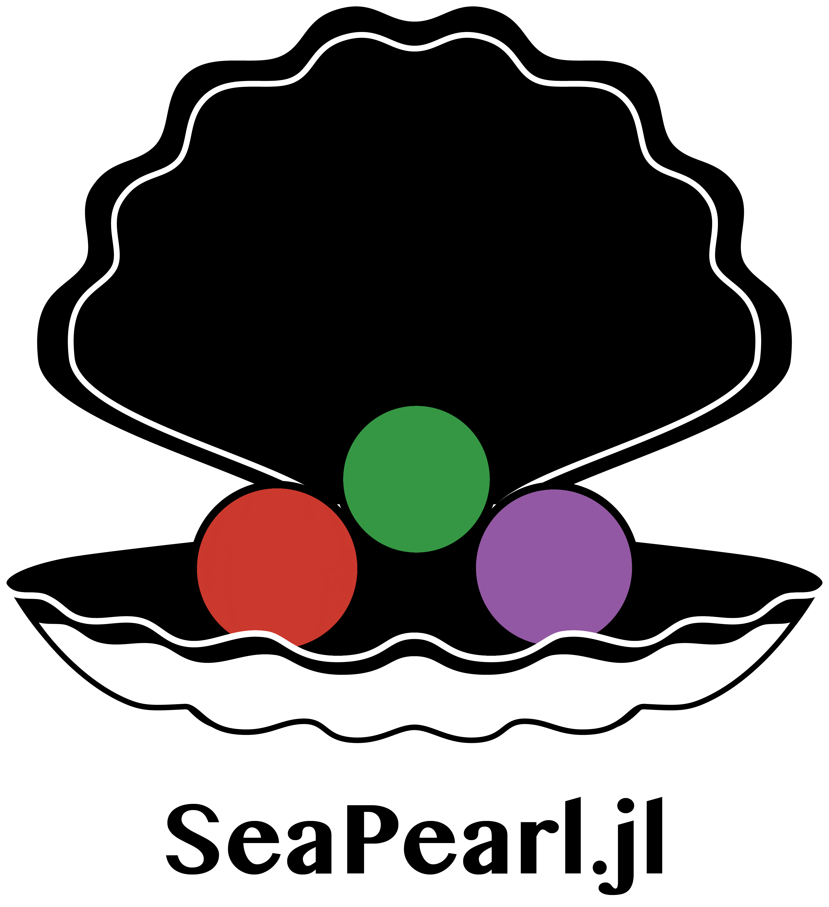

[](https://codecov.io/gh/corail-research/SeaPearl.jl)




SeaPearl is a Constraint Programming solver that can use Reinforcement Learning agents as value-selection heuristics, using graphs as inputs for the agent's approximator. It is to be seen as a tool for researchers that gives the possibility to go above and beyond what has already been done with it.

The paper accompanying this solver can be found on the [arXiv](https://arxiv.org/abs/2102.09193v1). If you use SeaPearl in your research, please cite our work.

The RL agents are defined using [ReinforcementLearning.jl](https://github.com/JuliaReinforcementLearning/ReinforcementLearning.jl), their inputs are dealt with using  [Flux.jl](https://github.com/FluxML/Flux.jl). The CP part, inspired from [MiniCP](http://www.minicp.org/), is focused on readability. The code is meant to be clear and modular so that researchers could easily get access to CP data and use it as input for their ML model.

## Installation

```julia
]add SeaPearl
```

## Use

Working examples can be found in [SeaPearlZoo](https://github.com/corail-research/SeaPearlZoo) and documentation can be found [here](https://corail-research.github.io/SeaPearl.jl/dev/).

SeaPearl can be used either as a classic CP solver that uses predefined variable and value selection heuristics or as Reinforcement Learning driven CP solver that is capable of learning through solving automatically generated instances of a given problem (knapsack, tsptw, graphcoloring, EternityII ...). 

### SeaPearl as a classic CP solver : 
To use SeaPearl as a classic CP solver, one needs to  : 
1. declare a variable selection heuristic : 
```julia
YourVariableSelectionHeuristic{TakeObjective} <: SeaPearl.AbstractVariableSelection{TakeObjective}
```
2. declare a value selection heuristic : 
```julia
BasicHeuristic <: ValueSelection
```
3. create a Constraint Programming Model : 
```julia
trailer = SeaPearl.Trailer()
model = SeaPearl.CPModel(trailer)

#create variable : 
SeaPearl.addVariable!(...)

#add constraints : 
SeaPearl.addConstraint!(model, SeaPearl.AbstractConstraint(...))

#add optionnal objective function : 
SeaPearl.addObjective!(model, ObjectiveVar)
```
### SeaPearl as a RL-driven CP solver : 
To use SeaPearl as a RL-driven CP solver, one needs to  : 
1. declare a variable selection heuristic : 
```julia
CustomVariableSelectionHeuristic{TakeObjective} <: SeaPearl.AbstractVariableSelection{TakeObjective}
```
2. declare a value selection learnedheuristic : 
```julia
LearnedHeuristic{SR<:AbstractStateRepresentation, R<:AbstractReward, A<:ActionOutput} <: ValueSelection
```
3. define an agent : 
```julia
agent = RL.Agent(
policy=(...),
trajectory=(...),
)
```
4.  *optionally*, declare a custom reward : 
```julia
CustomReward <: SeaPearl.AbstractReward 
```
5.  *optionally*, declare a custom StateRepresentation ( instead of the Default tripartite-graph representation ) : 
```julia
CustomStateRepresentation <: SeaPearl.AbstractStateRepresentation
```
6.  *optionally*, declare a custom featurization for the StateRepresentation : 
```julia
CustomFeaturization <: SeaPearl.AbstractFeaturization
```
8.  create a generator for your given problem, that will create different instances of the specific problem used during the learning process. 
```julia
CustomProblemGenerator <: AbstractModelGenerator
```
9.  set a number of training epochs, declare an evaluator, a Strategy, a metric for benchmarking
```julia
nb_epochs = 3000
CustomStrategy <: SearchStrategy #DFS, RBS, ILDS 

CustomEvaluator <: AbstractEvaluator #or use predefined one : SeaPearl.SameInstancesEvaluator(...)
function CustomMetricsFun
```
9. launch the training :  
```julia
metricsArray, eval_metricsArray = SeaPearl.train!(
valueSelectionArray=valueSelectionArray,
generator=tsptw_generator,
nbEpisodes=nbEpisodes,
strategy=strategy,
eval_strategy=eval_strategy,
variableHeuristic=variableSelection,
out_solver = true,
verbose = true,
evaluator=SeaPearl.SameInstancesEvaluator(valueSelectionArray,tsptw_generator; evalFreq = evalFreq, nbInstances = nbInstances, evalTimeOut = evalTimeOut),
restartPerInstances = restartPerInstances
)
```
)


## Contributing to SeaPearl

All contributions are welcome! Have a look at our [contributing guidelines](https://github.com/corail-research/SeaPearl.jl/blob/master/CONTRIBUTING.md).
